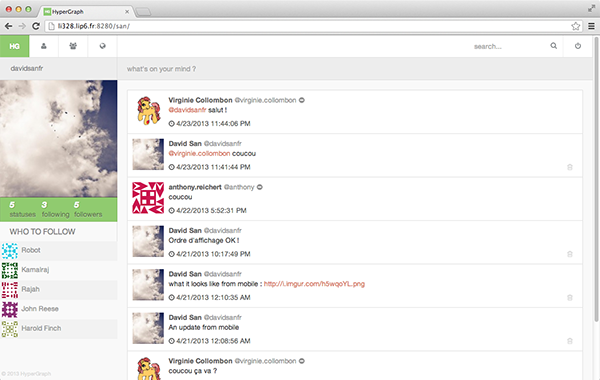
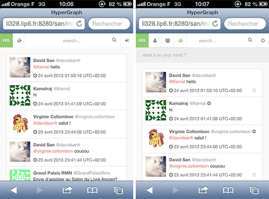
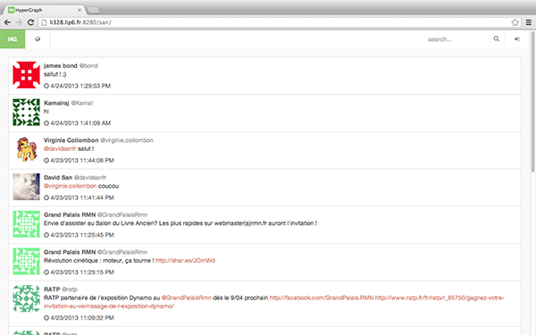
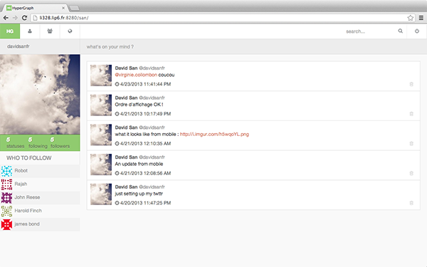
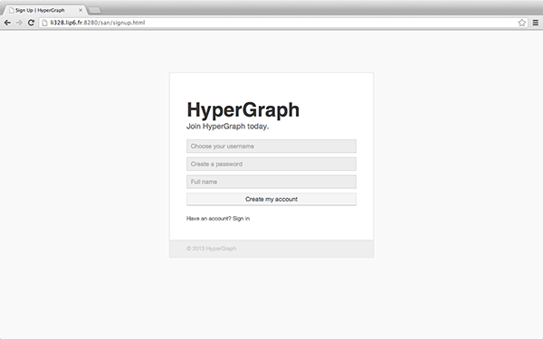

# Hypergraph

Hypergraph est un web service de micro-blogging similaire à Twitter.

[bigger](img/screen-main.png)

## Technologies utilisées

* Server-side : Tomcat 7, Java servlets, JSP, MySQL, MongoDB
* Client-side : xHTML, CSS3, JS, jQuery

##Gestion des avatars par l'API Gravatar##
*supporté uniquement pour les utilisateurs de Gravatar possédant une adresse @gmail.com*

Utilisation de l'API Gravatar pour gérer les avatars des utilisateurs.

##Eléments graphiques vectoriels##

Utilisation de la suite d'icônes vectoriels FontAwesome pour afficher les icônes contenus dans les éléments graphiques du site. 

##Web Design *Responsive*##

Utilisation des *media queries* de CSS3

##Suggestion d'utilisateurs##

Suggère des utilisateurs à suivre pour l'utilisateur connecté.

##Génération automatisée de la Web application Archive avec Ant##

Création d'un fichier build.xml pour pouvoir générer le fichier WAR en appelant Ant.

##Statistiques utilisateurs##

Les statistiques utilisateurs renseignent sur le nombre de messages posté par l'utilisateur, le nombre de personnes suivis par l'utilisateur et le nombre de personnes qui suivent l'utilisateur.

##Analyse syntaxique des messages##

Détection des URL dans les messages et des auteurs (@user) dans les messages et les rends cliquables.

## API/REST
* GET user/create
* GET auth/login
* GET auth/logout
* GET friendship/create
* GET friendship/destroy
* GET status/update
* GET status/destroy
* GET status/show
* GET status/list
* GET search/tweets
* GET user/show
* GET user/suggest

Voir le Wiki pour plus de détails.

## Screenshots

[bigger](img/screen-welcome.png)

[bigger](img/screen-main.png)

[bigger](img/screen-self.png)

[bigger](img/screen-signup.png)

[bigger](img/screen-login.png)

## Licence

(Licence MIT)

Copyright © David San

Permission is hereby granted, free of charge, to any person obtaining a copy of this software and associated documentation files (the "Software"), to deal in the Software without restriction, including without limitation the rights to use, copy, modify, merge, publish, distribute, sublicense, and/or sell copies of the Software, and to permit persons to whom the Software is furnished to do so, subject to the following conditions:

The above copyright notice and this permission notice shall be included in all copies or substantial portions of the Software.

THE SOFTWARE IS PROVIDED "AS IS", WITHOUT WARRANTY OF ANY KIND, EXPRESS OR IMPLIED, INCLUDING BUT NOT LIMITED TO THE WARRANTIES OF MERCHANTABILITY, FITNESS FOR A PARTICULAR PURPOSE AND NONINFRINGEMENT. IN NO EVENT SHALL THE AUTHORS OR COPYRIGHT HOLDERS BE LIABLE FOR ANY CLAIM, DAMAGES OR OTHER LIABILITY, WHETHER IN AN ACTION OF CONTRACT, TORT OR OTHERWISE, ARISING FROM, OUT OF OR IN CONNECTION WITH THE SOFTWARE OR THE USE OR OTHER DEALINGS IN THE SOFTWARE.
