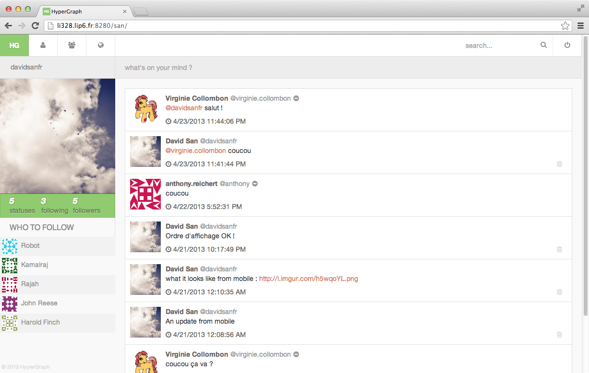
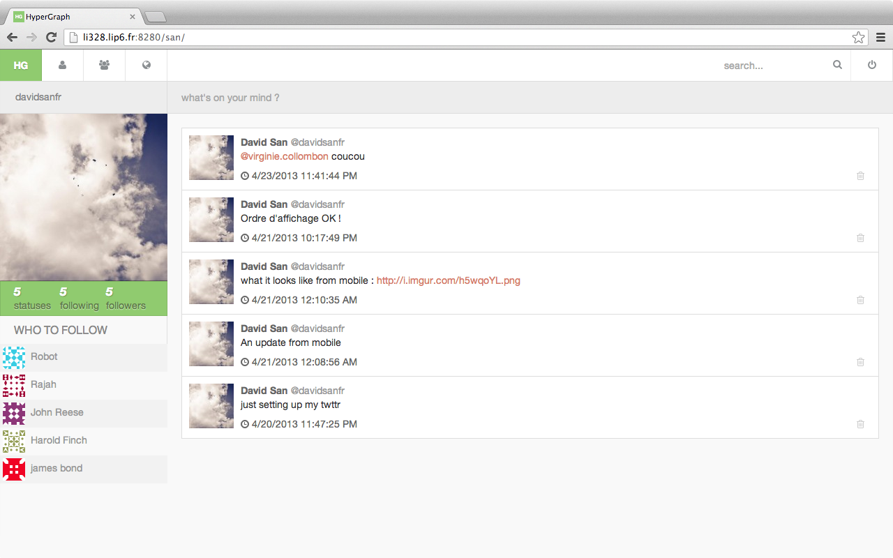
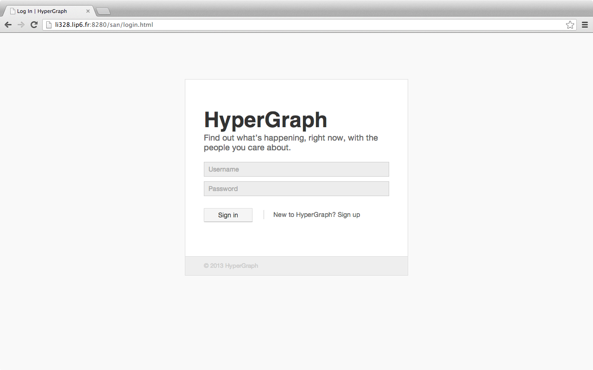

# Hypergraph

Hypergraph est un web service de micro-blogging similaire à Twitter.

## Technologies utilisées

* Server-side : Tomcat 7, Java servlets, JSP, MySQL, MongoDB
* Client-side : xHTML, CSS3, JS, jQuery

##Gestion des avatars par l'API Gravatar##
*supporté uniquement pour les utilisateurs de Gravatar possédant une adresse @gmail.com*

Utilisation de l'API Gravatar pour gérer les avatars des utilisateurs.

##Eléments graphiques vectoriels##

Utilisation de la suite d'icônes vectoriels FontAwesome pour afficher les icônes contenus dans les éléments graphiques du site. 

##Web Design *Responsive*##

Utilisation des *media queries* de CSS3

##Suggestion d'utilisateurs##

Suggère des utilisateurs à suivre pour l'utilisateur connecté.

##Génération automatisée de la Web application Archive avec Ant##

Création d'un fichier build.xml pour pouvoir générer le fichier WAR en appelant Ant.

##Statistiques utilisateurs##

Les statistiques utilisateurs renseignent sur le nombre de messages posté par l'utilisateur, le nombre de personnes suivis par l'utilisateur et le nombre de personnes qui suivent l'utilisateur.

##Analyse syntaxique des messages##

Détection des URL dans les messages et des auteurs (@user) dans les messages et les rends cliquables.

## API/REST
* GET user/create
* GET auth/login
* GET auth/logout
* GET friendship/create
* GET friendship/destroy
* GET status/update
* GET status/destroy
* GET status/show
* GET status/list
* GET search/tweets
* GET user/show
* GET user/suggest

Voir le Wiki pour plus de détails.

## Screenshots

